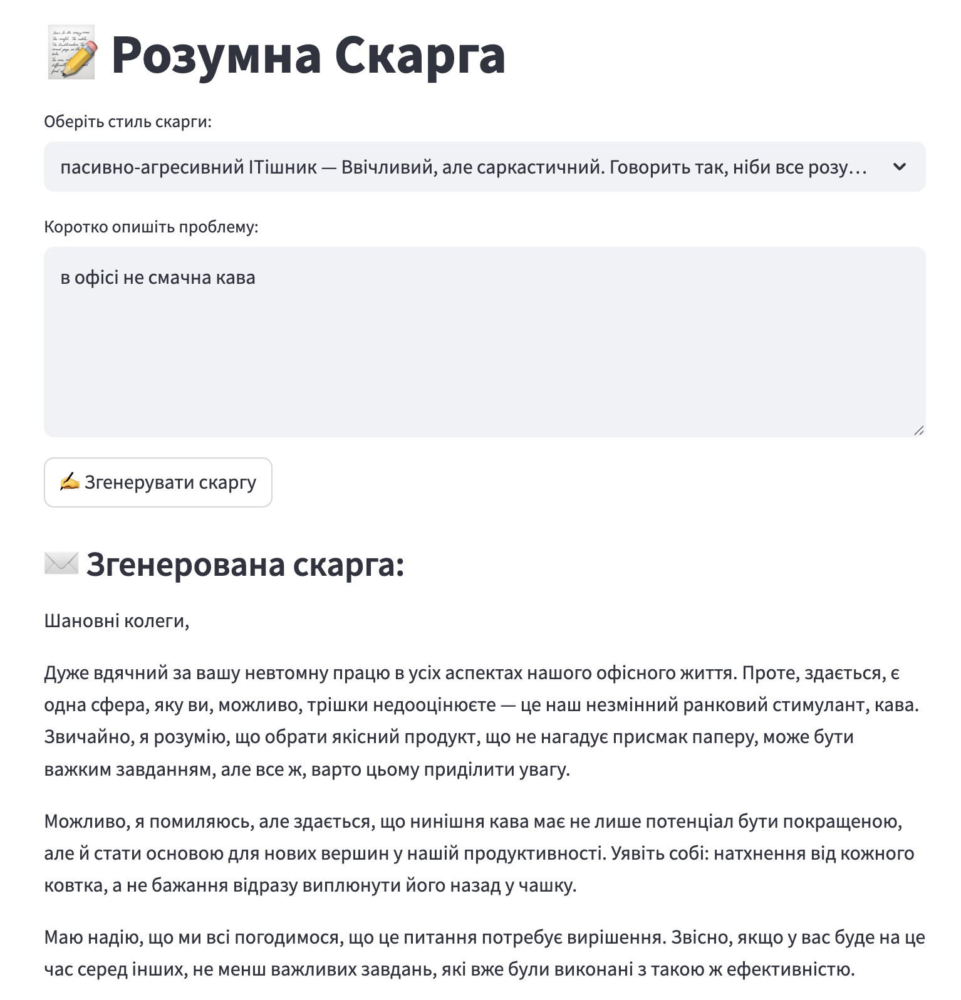

## Smart complain
Complain generation based on pre-defined roles

### 1. Environment set up
For the local development, if you need to adjust functionality and/or add new modules:

```
uv init smart_complaint
cd smart_complaint
uv run pip3 install -r requirements.txt
```

```
 source ~/PycharmProjects/smart_complaint/smart_complaint/.venv/bin/activate
```

### 2. Run app on UI

```
source ~/PycharmProjects/smart_complaint/smart_complaint/.venv/bin/activate
streamlit run app.py
```
Output:

```
 You can now view your Streamlit app in your browser.

  Local URL: http://localhost:8503
  Network URL: http://192.168.54.37:8503
```

### 3. Run in Docker container

```
docker build -t smart-complaint-app .
docker run -p 8507:8507 --env-file .env smart-complaint-app
```

Output:

```
  You can now view your Streamlit app in your browser.

  URL: http://0.0.0.0:8507

```

### 4. Run tests

```
pytest tests/test_output.py -v

```

```
Output:

====================================================================== test session starts =======================================================================
platform darwin -- Python 3.10.17, pytest-7.4.4, pluggy-1.6.0 -- /Users/iryna.yevdokymova/PycharmProjects/smart_complaint/smart_complaint/.venv/bin/python
cachedir: .pytest_cache
rootdir: /Users/iryna.yevdokymova/PycharmProjects/smart_complaint
plugins: anyio-4.9.0
collected 2 items                                                                                                                                                

tests/test_output.py::test_prompts_folder_contains_required_files PASSED                                                                                   [ 50%]
tests/test_output.py::test_styles_json_has_required_fields PASSED                                                                                          [100%]

======================================================================= 2 passed in 0.01s ========================================================================
```

## Example of UI



